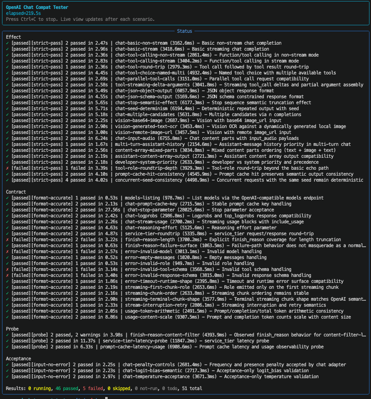

# OpenAI SDK Compat Tester



Standalone conformance tester for APIs that claim compatibility with OpenAI SDK
Chat Completions and Responses APIs.

Chinese version: `README_ZH.md`

It is designed for router authors, proxy maintainers, gateway teams, and SDK
integrators who need evidence-based compatibility checks instead of one-off
manual prompts.

## What It Verifies

- `Effect`: semantic behavior that should visibly work
- `Contract`: request, response, stream, and error-shape compatibility
- `Probe`: observational checks that should not hard-fail support claims
- `Acceptance-only`: request acceptance without claiming semantic equivalence

## Quickstart

Install with `uv`:

```bash
cd openai-sdk-compat-tester
uv sync --extra dev
```

Or with `venv` + `pip`:

```bash
cd openai-sdk-compat-tester
python3 -m venv .venv
source .venv/bin/activate
pip install -e .
```

Run Chat Completions coverage only:

```bash
OPENAI_COMPAT_RUN_LIVE=1 \
OPENAI_COMPAT_BASE_URL=http://127.0.0.1:18080/v1 \
OPENAI_COMPAT_MODEL=gpt-5.4 \
uv run openai-sdk-compat run --api-mode chat
```

Run Responses API coverage only:

```bash
OPENAI_COMPAT_RUN_LIVE=1 \
OPENAI_COMPAT_BASE_URL=http://127.0.0.1:18080/compat/v1 \
OPENAI_COMPAT_MODEL=gpt-5.4 \
uv run openai-sdk-compat run --api-mode responses
```

Run both API modes:

```bash
OPENAI_COMPAT_RUN_LIVE=1 \
OPENAI_COMPAT_BASE_URL=http://127.0.0.1:18080/compat/v1 \
OPENAI_COMPAT_MODEL=gpt-5.4 \
uv run openai-sdk-compat run --api-mode all
```

## CLI

List the inventory:

```bash
openai-sdk-compat list --api-mode all
```

Run one suite and show a live terminal status panel:

```bash
OPENAI_COMPAT_RUN_LIVE=1 \
OPENAI_COMPAT_BASE_URL=http://127.0.0.1:18080/v1 \
OPENAI_COMPAT_MODEL=gpt-5.4 \
openai-sdk-compat run --api-mode chat --suite effect
```

Use `--api-mode chat`, `--api-mode responses`, or `--api-mode all`.
Use `/v1` as the base URL for native OpenAI-compatible chat endpoints, and
`/compat/v1` when testing this router's compat endpoints.

`run` streams progress in real time as each capability starts and finishes, then
prints a full matrix summary at the end.
When stdout is a TTY, `run` defaults to a lightweight `Rich Live` status panel
instead of the older ANSI clear-screen renderer.
Use `--plain` to force the scrolling output.
Live chat scenarios resolve their model via `/v1/models` first; if
`OPENAI_COMPAT_MODEL` is unset, or names a model the router does not advertise,
the tester falls back to the first returned model.

Run one capability by slug:

```bash
OPENAI_COMPAT_RUN_LIVE=1 \
OPENAI_COMPAT_BASE_URL=http://127.0.0.1:18080/v1 \
OPENAI_COMPAT_MODEL=gpt-5.4 \
openai-sdk-compat run --api-mode chat --slug chat-logit-bias-semantic
```

Write a machine-readable report:

```bash
OPENAI_COMPAT_RUN_LIVE=1 \
OPENAI_COMPAT_BASE_URL=http://127.0.0.1:18080/v1 \
openai-sdk-compat run --api-mode chat --suite contract --format json --output artifacts/report.json
```

Run the full suite across every model advertised by `/compat/v1/models`:

```bash
mkdir -p artifacts/model-matrix
for model in $(curl -s http://127.0.0.1:18080/compat/v1/models | python3 -c 'import json,sys; print("\n".join(m["id"] for m in json.load(sys.stdin)["data"]))'); do
  OPENAI_COMPAT_RUN_LIVE=1 \
  OPENAI_COMPAT_BASE_URL=http://127.0.0.1:18080/compat/v1 \
  OPENAI_COMPAT_MODEL="$model" \
  openai-sdk-compat run --api-mode all --only-executed --format json \
    --output "artifacts/model-matrix/${model}.json" \
    > "artifacts/model-matrix/${model}.log" 2>&1 &
done
wait
```

Model matrix artifacts are intentionally ignored by git. They are useful for
local compatibility triage, but should not be committed because they are live,
account-specific evidence.

## CI Example

```yaml
- name: Install tester
  run: pip install openai-sdk-compat-tester

- name: Run contract suite
  env:
    OPENAI_COMPAT_RUN_LIVE: "1"
    OPENAI_COMPAT_BASE_URL: http://127.0.0.1:18080/v1
  run: openai-sdk-compat run --api-mode chat --suite contract --format json --output artifacts/report.json
```

## Environment

- `OPENAI_COMPAT_RUN_LIVE=1`
- `OPENAI_COMPAT_BASE_URL`
  Use `/compat/v1` when testing this router's OpenAI-style compat endpoints.
- `OPENAI_COMPAT_API_KEY`
- `OPENAI_COMPAT_MODEL`
  Optional override. The live suite validates it against `/v1/models` and falls
  back to the first advertised model when it is unset or unavailable.
- Live HTTP clients read the system proxy environment by default, including
  `HTTP_PROXY`, `HTTPS_PROXY`, and `NO_PROXY`.

## Result Semantics

- `Effect`
  Stable semantic behavior is asserted. Failure means the endpoint does not
  support the claimed OpenAI-compatible behavior.
- `Contract`
  Protocol shape, response shape, error shape, or stream shape is asserted.
  Failure means the endpoint does not support the claimed OpenAI-compatible behavior.
- `Probe`
  Observational only. These tests do not hard-fail support claims.
- `Acceptance-only`
  A narrow exception used only when stable semantic validation is infeasible.
  Examples include chat `logit_bias` acceptance, chat sampling-control
  acceptance, and Responses optional-field acceptance / compat-gap checks.

## Non-goals

- It does not benchmark model quality or rank providers.
- It does not claim semantic identity for every accepted parameter.
- It does not replace provider-specific end-to-end product tests.

## Conversation Coverage Rule

- Ordinary passing scenarios should cover both a single-turn and a multi-turn
  variant in the same test file.
- Naturally multi-turn scenarios should use longer history instead of only a
  short extra prefix.
- In pytest counts, ordinary covered conversation scenarios therefore usually
  show `2 passed` / `2 skipped`, while intrinsically multi-step scenarios may
  still show `1 passed` / `1 skipped` when the file already encodes a longer
  multi-turn exchange directly.
- Multilingual context is mixed into conversation history using English,
  Japanese, and Chinese.

## Prompt Stability Guidelines

- Keep `system` messages focused on role, mode, and durable behavior.
- Put case-specific facts, output keys, exact text, and field values in `user`
  messages. This makes weaker or faster models less likely to overfit the role
  prompt while still following the concrete task.
- When a scenario compares default prose output against structured output, use
  separate message lists for the baseline and structured calls. Avoid asking one
  prompt to encode two contradictory modes.
- Make semantic assertions robust against hidden reasoning-token variation. For
  usage-scaling checks, request visibly longer exact text instead of relying on a
  short phrase to produce more completion tokens.
- For tool-result round trips, say explicitly whether a JSON tool result should
  be echoed as JSON or parsed into a field value. Preserve the protocol
  distinction between a tool result object and the final assistant text.

## Layout

- `src/openai_sdk_compat_tester/` package and CLI
- `tests/effect/` semantic behavior tests
- `tests/contract/` protocol / shape / error / stream tests
- `tests/probe/` observational tests
- `tests/acceptance/` reserved for narrow exceptions
- `tests/test_scenario_catalog.py` catalog sanity checks
- `.github/workflows/ci.yml` example CI entrypoint for the standalone project

## API Modes

- `chat`: OpenAI Chat Completions compatibility.
- `responses`: OpenAI Responses API compatibility.
- `all`: list or run all covered scenarios.

Examples:

```bash
openai-sdk-compat list --api-mode responses
openai-sdk-compat run --api-mode responses --suite contract
openai-sdk-compat run --api-mode all --only-executed
```

## Covered Tests

### Effect

- Basic chat
  `tests/effect/test_chat_basic_non_stream_live.py`
  `tests/effect/test_chat_basic_stream_live.py`
- Tool calling
  `tests/effect/test_chat_tools_non_stream_live.py`
  `tests/effect/test_chat_tools_stream_live.py`
  `tests/effect/test_chat_tools_round_trip_live.py`
  `tests/effect/test_chat_tools_named_choice_multi_live.py`
  `tests/effect/test_chat_parallel_tool_calls_live.py`
  `tests/effect/test_tool_streaming_delta_arguments_live.py`
- Structured output
  `tests/effect/test_chat_response_format_json_object_live.py`
  `tests/effect/test_chat_response_format_json_schema_live.py`
- Sampling and deterministic behavior
  `tests/effect/test_stop_effect_live.py`
  `tests/effect/test_chat_seed_consistency_live.py`
  `tests/effect/test_chat_n_completions_live.py`
- Multimodal and content semantics
  `tests/effect/test_vision_base64_live.py`
  `tests/effect/test_vision_generated_text_ocr_live.py`
  `tests/effect/test_vision_remote_url_live.py`
  `tests/effect/test_chat_input_audio_live.py`
  `tests/effect/test_content_mixed_parts_order_live.py`
  `tests/effect/test_content_assistant_array_output_live.py`
- Conversation semantics
  `tests/effect/test_history_assistant_priority_live.py`
  `tests/effect/test_role_developer_system_priority_live.py`
  `tests/effect/test_role_tool_roundtrip_complex_live.py`
- Prompt cache and concurrency semantics
  `tests/effect/test_prompt_cache_hit_consistency_live.py`
  `tests/effect/test_concurrent_seed_consistency_live.py`
- Responses API
  `tests/effect/test_responses_*_live.py`

### Contract

- Models and request surface
  `tests/contract/test_models_live.py`
  `tests/contract/test_chat_prompt_cache_key_live.py`
  `tests/contract/test_chat_stop_sequences_live.py`
  `tests/contract/test_chat_reasoning_effort_live.py`
- Response and stream contract
  `tests/contract/test_chat_logprobs_live.py`
  `tests/contract/test_chat_stream_include_usage_live.py`
  `tests/contract/test_finish_reason_length_live.py`
  `tests/contract/test_finish_reason_error_state_live.py`
  `tests/contract/test_stream_first_chunk_role_live.py`
  `tests/contract/test_stream_chunk_order_live.py`
  `tests/contract/test_stream_terminal_chunk_shape_live.py`
  `tests/contract/test_stream_interruption_retry_live.py`
- Error contract
  `tests/contract/test_error_invalid_model_live.py`
  `tests/contract/test_error_empty_messages_live.py`
  `tests/contract/test_error_invalid_role_live.py`
  `tests/contract/test_error_invalid_tool_schema_live.py`
  `tests/contract/test_error_invalid_response_schema_live.py`
  `tests/contract/test_error_timeout_runtime_shape_live.py`
- Service tier and usage contract
  `tests/contract/test_service_tier_roundtrip_live.py`
  `tests/contract/test_usage_token_arithmetic_live.py`
  `tests/contract/test_usage_content_scale_live.py`
- Responses API
  `tests/contract/test_responses_*_live.py`

### Probe

- Prompt caching observability
  `tests/probe/test_prompt_cache_latency_usage_live.py`
- Service tier latency observability
  `tests/probe/test_service_tier_latency_probe_live.py`
- Finish reason content-filter observability
  `tests/probe/test_finish_reason_content_filter_live.py`

### Acceptance-only

- `logit_bias`
  `tests/acceptance/test_chat_logit_bias_live.py`
  scope: validates request acceptance and normal response shape only
- Chat sampling controls
  `tests/acceptance/test_chat_frequency_presence_penalty_live.py`
  `tests/acceptance/test_chat_temperature_live.py`
  scope: validates request acceptance and normal response shape only
- Responses optional fields
  `tests/acceptance/test_responses_*_live.py`
  scope: validates optional field acceptance and normal compat-gap error shapes

## Open Source Readiness Notes

- License: MIT
- Python: `>=3.9`
- Local automation: see [CONTRIBUTING.md](./CONTRIBUTING.md)
- CI template: see [`.github/workflows/ci.yml`](./.github/workflows/ci.yml)
